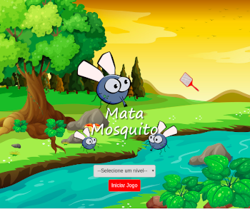

### Jogo Mata-mosquito

<strong>Objetivo do jogo:</strong> eliminar todos os mosquitos e impedir uma nova epidemia do século XXI chamada 'DevMoribundus'.Essa doença é altamente contagiosa e perigosa, pois ataca a personalidade de programador@s fazendo com que el@s deixem de se interessar por camisetas, seriados e filmes nerds como Star Wars! :laughing:  
<strong>Níveis de dificuldade:</strong> está relacionando ao tempo que o mosquito permanece na tela para ser morto  
<ul>
	<li>Fácil: 2seg</li>
	<li>Normal: 1.5seg</li>
	<li>Difícil: 1seg</li>
</ul>

Aplicação desenvolvida em javascript puro durante atividades do curso on-line Desenvolvimento Web - Udemy. As imagens do jogo foram cedida pelo curso

__Link:__ https://nmonalisa.github.io/Jogo-Mata-Mosquito/

